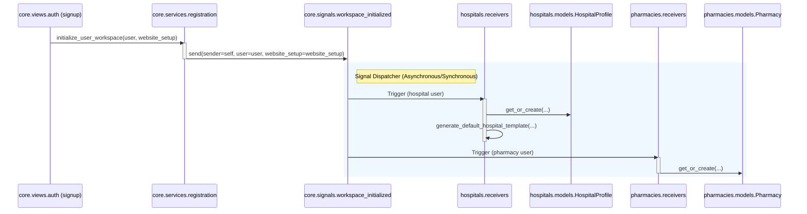

# Data Model and Logical Components: Decouple Backend Modules

This document outlines the logical design, components, and event flows. There are no database schema modifications or new database tables introduced in this feature. All decoupling is achieved at the service and event layer.

## 1. Event Flows & Custom Signals

### `core.signals.workspace_initialized`
A custom Django signal dispatched by the core signup service when a new user registers a business and a `WebsiteSetup` record is generated.

#### Signal Arguments
- `sender` (object): The class/instance dispatching the signal.
- `user` (`core.models.User`): The newly registered user instance.
- `website_setup` (`core.models.WebsiteSetup`): The created website setup instance.

---

## 2. Logical Components

### `ChatbotCoordinatorService`
A service layer class responsible for routing incoming chatbot queries to the appropriate backend provider based on the website tenant's business type.

#### Interfaces & Methods

##### `generate_response(cls, website_setup, history, user_message, patient_profile=None)`
- **Parameters**:
  - `website_setup` (`core.models.WebsiteSetup`): The tenant website context.
  - `history` (`Iterable[core.models.ChatMessage]`): Previous conversation message history.
  - `user_message` (str): The latest message sent by the user.
  - `patient_profile` (dict, optional): Contextual metadata about the patient.
- **Returns**: `ChatbotResponse` (a consistent domain object containing answers, suggestions, specialties, and disclaimer).
- **Behavior**:
  - Checks `website_setup.user.business_type`.
  - If `hospital`, delegates execution to `MedicalChatbotService.generate_response`.
  - If `pharmacy`, dynamically imports `ask_rag` from `rag_model.services.rag_service` locally, executes RAG, and wraps the dictionary result in a `ChatbotResponse`-compatible object.

##### `generate_fallback_response(cls, ai_settings, user_message, reason)`
- Delegates directly to `MedicalChatbotService.generate_fallback_response`.
